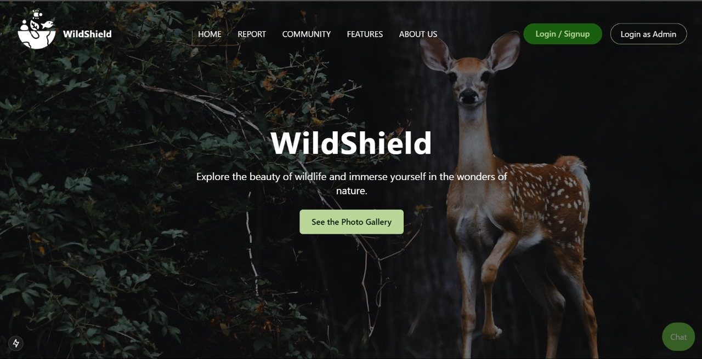
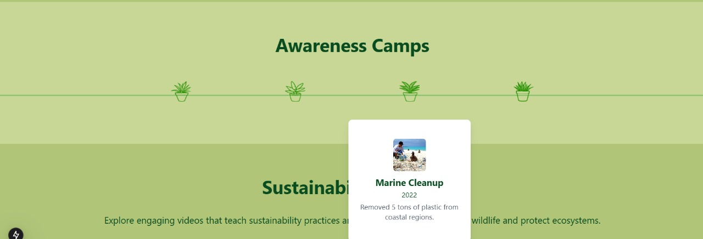
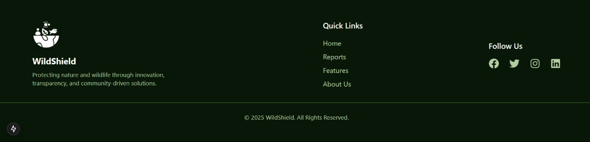
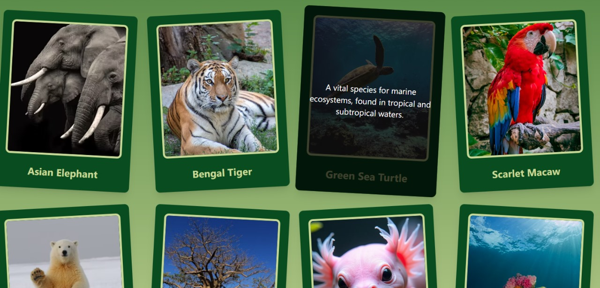
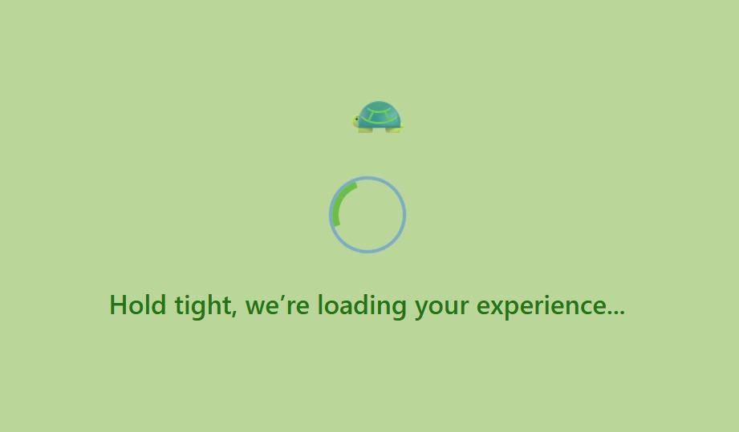

# wildshield
a platform for reporting wildlife threats: real-time, community-powered, ai-backed.

---

## why it exists  
response to fires, poaching, and distress is often too slow.  
we built this to bridge the silence between tourists, locals, and NGOs.

---

## what it does  
- maps and monitors incidents: fire, poaching, animal behavior  
- enables real-time reporting anonymous and verified  
- analyzes photos and videos using ai: wildlife, injuries, plant life  
- predicts fire spread using weather data  
- tracks animal movement and disease  
- provides NGOs tools to act faster, smarter  

---

## my part  
i led the design and ui/ux 
from how it moves, to how it feels.  
i shaped the visual language:  
color, motion, layout, flow.  

---

## design in action 
this platform isn’t just built, it’s felt.  
i shaped the experience to speak calm, clarity, and care.

> here’s a peek into the visual story ↓  

  
  
  
  


---

## built with  
- next.js, react.js, tailwind  
- flask, express, node.js  
- mongodb, postgresql  
- pytorch, tensorflow, yolo, resnet50, inceptionv3, llama  
- openweather api, mapbox api  
- jwt auth + otp verification

---

## try it locally  

```bash
git clone https://github.com/yourusername/wild.git  
cd wild  
npm install  
npm run dev  
